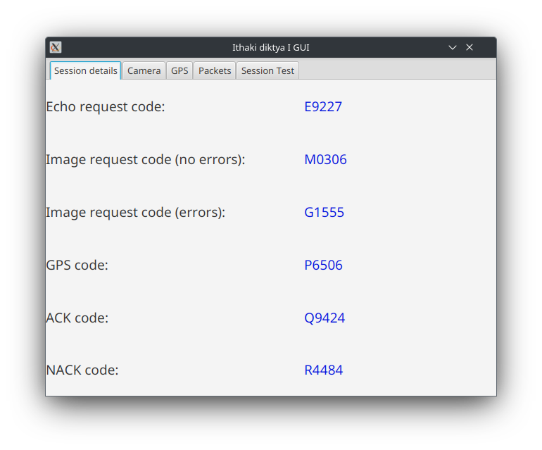
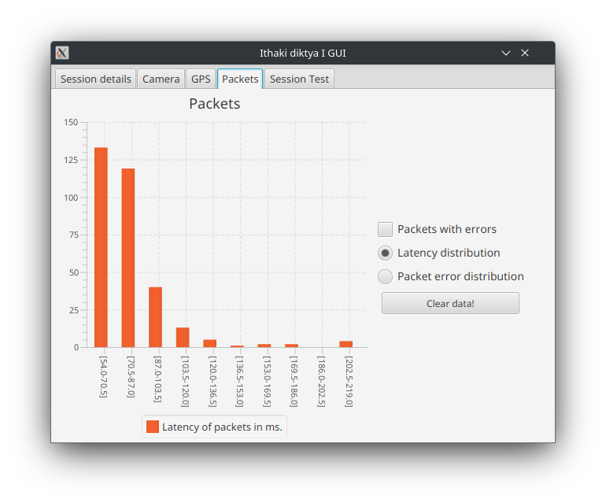
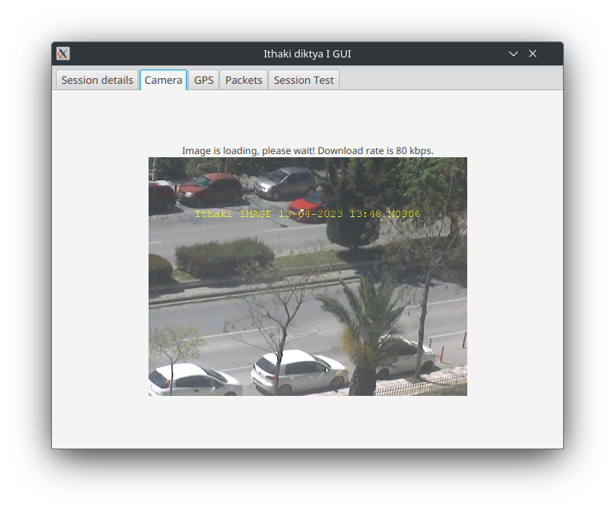
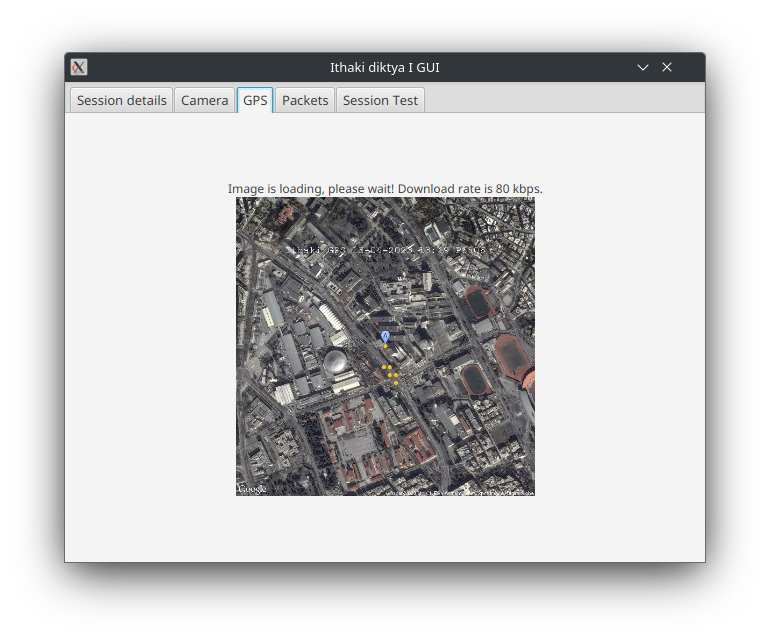

# diktya1-guiApp

<!--BEGIN SHIELDS.IO-->

<!--END SHIELDS.IO-->
GUI variation of assignment for lesson "Computer Networks I". 

    
    
    
    

## Features
- Automatically obtain session codes from "ithaki" server
- Simple, easy-to-use GUI
- Camera live streaming
- Display live packet delay times and error histograms
- Perform and customize the required assignment session tests
- Export session test's packet statistics into convenient CSV format for further processing

## Building and Installation
To build this project, [maven](https://maven.apache.org/) is required and Java version 11 or above. 

### Using terminal
The steps are the following on terminal;  
1. `mvn clean` so the local library under _lib_ directory gets installed.
2. `mvn clean javafx:run` to prepare and test JavaFX dependencies
3. In case you need a standalone jar file, run `mvn install`.

### Using Eclipse maven plugin
If you use the eclipse maven plugin, then you will simply need 3 run configurations with goals _clean_ , _clean javafx:run_ and _install_ accordingly. Run them on the same sequence as above.

## Notes

### Testing information
This project was tested on Java 17+ versions and developed using the [Eclipse IDE](https://www.eclipse.org/downloads/).

### Other notes
Please note that occasionally server may respond with invalid data. In that case, just restarting of program, or the session test, if this occurs during that, is enough.
